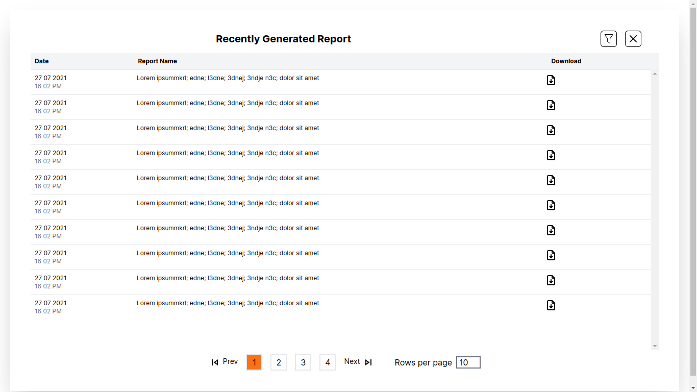

# Report Viewer

This project is a simple report viewer web application built using Next.js. It allows users to view a list of reports, filter them, and download individual reports.

## Features

- Display recently generated reports
- Filter reports
- Download individual reports
- Pagination for easy navigation through reports
- Adjustable number of rows per page

## Technologies Used

- Next.js
- React
- Tailwind CSS

## Usage

1. Clone the repository.
2. Install dependencies using `npm install`.
3. Run the development server using `npm run dev`.
4. Access the application at `http://localhost:3000`.

## Screenshots

## License

This project is licensed under the MIT License - see the [LICENSE](LICENSE) file for details.

